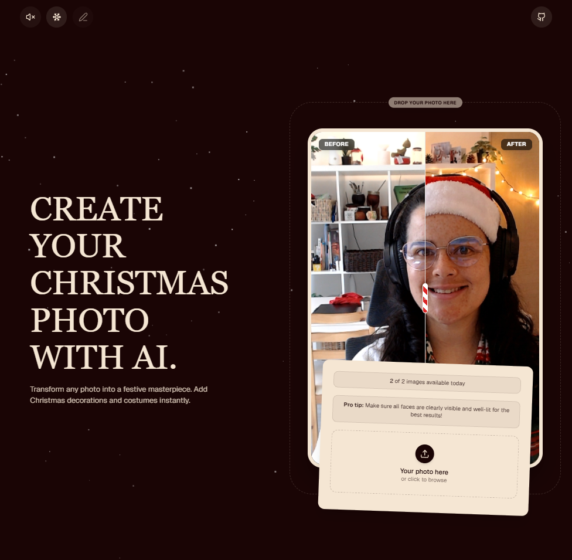

# 🎄 Christmas Photo Editor

A festive web application that transforms your normal photos into magical Christmas memories using Artificial Intelligence.



## ✨ Features

- **AI Transformation**: Uses Google Gemini 3 Pro to add Christmas decorations and festive attire to people in your photos, keeping their original faces and expressions.
- **Before/After Comparison**: Visualize the transformation with an interactive slider.
- **Festive Atmosphere**: Falling snow effect and optional background music ("Jingle Bells").
- **Shareable Results**: Generate unique links to share your creations with friends and family.
- **Rate Limiting**: Usage limit system to prevent abuse (configured with Upstash Redis).
- **Responsive Design**: Works perfectly on mobile and desktop.

## 🛠️ Technologies Used

- **Framework**: [Next.js 15](https://nextjs.org/) (App Router)
- **Language**: TypeScript
- **Styles**: [Tailwind CSS](https://tailwindcss.com/)
- **UI Components**: [Shadcn UI](https://ui.shadcn.com/) / [Radix UI](https://www.radix-ui.com/)
- **Animations**: [Framer Motion](https://www.framer.com/motion/)
- **AI**: [Vercel AI SDK](https://sdk.vercel.ai/) with Google Gemini
- **Storage**: [Vercel Blob](https://vercel.com/docs/storage/vercel-blob)
- **Database / Rate Limiting**: [Upstash Redis](https://upstash.com/)

## 🚀 Getting Started

Follow these steps to run the project in your local environment.

### Prerequisites

- Node.js 18+ installed
- pnpm installed (`npm install -g pnpm`)

### Installation

1. Clone the repository:

   ```bash
   git clone <repository-url>
   cd christmas-photo
   ```

2. Install dependencies:

   ```bash
   pnpm install
   ```

3. Configure environment variables. Create a `.env.local` file in the root of the project with the following variables:

   ```env
   # Google AI (Gemini)
   GOOGLE_GENERATIVE_AI_API_KEY=your_google_api_key

   # Vercel Blob (Image Storage)
   BLOB_READ_WRITE_TOKEN=your_vercel_blob_token

   # Upstash Redis (Rate Limiting and Metadata)
   KV_REST_API_URL=your_upstash_redis_url
   KV_REST_API_TOKEN=your_upstash_redis_token
   ```

4. Run the development server:

   ```bash
   pnpm dev
   ```

5. Open [http://localhost:3000](http://localhost:3000) in your browser.

## 📝 Project Structure

- `app/`: Next.js routes and pages (App Router).
- `components/`: Reusable React components (UI, views, effects).
- `server/`: Server-side logic (Server Actions, AI configuration, storage).
- `lib/`: Utilities and helper functions.
- `public/`: Static files.
